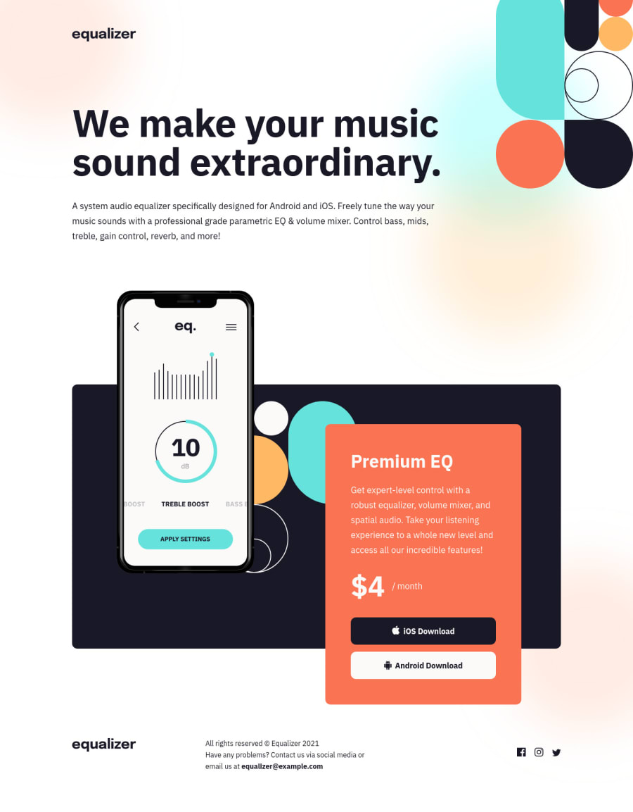

# Frontend Mentor - Equalizer landing page solution

This is a solution to the [Equalizer landing page challenge on Frontend Mentor](https://www.frontendmentor.io/challenges/equalizer-landing-page-7VJ4gp3DE). Frontend Mentor challenges help you improve your coding skills by building realistic projects.

## Table of contents

- [Overview](#overview)
  - [The challenge](#the-challenge)
  - [Screenshot](#screenshot)
  - [Links](#links)
- [My process](#my-process)
  - [Built with](#built-with)
- [Author](#author)

**Note: Delete this note and update the table of contents based on what sections you keep.**

## Overview

### The challenge

Users should be able to:

- View the optimal layout depending on their device's screen size
- See hover states for interactive elements

### Screenshot

### Links

- Solution URL: (https://www.frontendmentor.io/solutions/equalizer-landing-page-la8hADZpJ)
- Live Site URL: (https://equalizer-landing-page-dumitru.netlify.app/)

## My process

### Built with

- HTML5
- CSS3
- Flexbox
- CSS Grid

## Author

- Frontend Mentor - [@dimkabuzz](https://www.frontendmentor.io/profile/dimkabuzz)
